# 腾讯云 MCP 服务

腾讯云相关产品的 MCP 服务，帮助您充分利用腾讯云能力。无论您在何处使用 MCP，都能构建云原生应用、管理基础设施并加速 AI 开发与部署。

[](LICENSE)

**🌍 Languages:** [English](README.md) | **中文**

## 目录

- [腾讯云 MCP 服务](#腾讯云-mcp-服务)
  - [目录](#目录)
  - [什么是模型上下文协议(MCP)，它如何与腾讯云 MCP 服务协同工作？](#什么是模型上下文协议mcp它如何与腾讯云-mcp-服务协同工作)
  - [为什么选择腾讯云 MCP 服务？](#为什么选择腾讯云-mcp-服务)
  - [可用的 MCP 服务：快速安装](#可用的-mcp-服务快速安装)
    - [项目管理](#项目管理)
    - [开发提效](#开发提效)
    - [SaaS](#SaaS)
    - [PaaS](#PaaS)
    - [IaaS](#IaaS)
  - [何时使用本地与远程 MCP 服务？](#何时使用本地与远程-mcp-服务)
    - [本地 MCP 服务](#本地-mcp-服务)
    - [远程 MCP 服务](#远程-mcp-服务)
  - [远程和本地 MCP 服务安装与设置](#远程和本地-mcp-服务安装与设置)
    - [远程 MCP 服务开通与配置](#远程-mcp-服务开通与配置)
    - [本地 MCP 服务安装与设置](#本地-mcp-服务安装与设置)
  - [各 IDE 安装与设置](#各-IDE-安装与设置)
    - [CodeBuddy 入门](#CodeBuddy-入门)
      - [`codebuddy_mcp_settings.json`](#codebuddymcpsettingsjson)
    - [Cursor 入门](#cursor-入门)
      - [`.cursor/mcp.json`](#cursormcpjson)
    - [Windsurf 入门](#windsurf-入门)
      - [`~/.codeium/windsurf/mcp_config.json`](#codeiumwindsurfmcp_configjson)
    - [VS Code 入门](#vs-code-入门)
      - [`.vscode/mcp.json`](#vscodemcpjson)


## 什么是模型上下文协议(MCP)，它如何与腾讯云 MCP 服务协同工作？

> 模型上下文协议(MCP)是一种开放协议，能够实现 LLM 应用与外部数据源和工具之间的无缝集成。无论您是构建 AI 驱动的 IDE、增强聊天界面，还是创建自定义 AI 工作流，MCP 都提供了一种标准化方式，将 LLM 与其所需的上下文连接起来。
>
> &mdash; [模型上下文协议 README](https://github.com/modelcontextprotocol#:~:text=The%20Model%20Context,context%20they%20need.)

MCP 服务是一种轻量级程序，通过标准化的模型上下文协议暴露特定功能。宿主应用程序（如聊天机器人、IDE 和其他 AI 工具）拥有与 MCP 服务保持 1:1 连接的 MCP 客户端。常见的 MCP 客户端包括智能 AI 编码助手（如 CodeBuddy、Cursor、Q Developer、Cline、Windsurf）以及像 Claude Desktop 这样的聊天机器人应用，未来还会有更多客户端加入。MCP 服务可以访问本地数据源和远程服务，提供充分的上下文信息，从而改善模型的输出质量。

腾讯云 MCP 服务利用此协议为 AI 应用提供腾讯云文档、上下文指导和最佳实践的访问能力。通过标准化的 MCP 客户端-服务器架构，腾讯云功能成为您开发环境或 AI 应用的智能扩展。

腾讯云 MCP 服务支持增强云原生开发、基础设施管理和开发工作流程，使 AI 辅助云计算变得更加便捷高效。

模型上下文协议是由 Anthropic, PBC. 运营的开源项目，欢迎整个社区贡献。有关 MCP 的更多信息，您可以在[这里](https://modelcontextprotocol.io/introduction)找到进一步的文档。

## 为什么选择腾讯云 MCP 服务？

MCP 服务通过以下几种关键方式增强基础模型(FM)的能力：

- **提升输出质量**：通过在模型上下文中直接提供相关信息，MCP 服务显著改善了模型在腾讯云服务等专业领域的响应。这种方法减少了幻觉，提供更准确的技术细节，实现更精确的代码生成，并确保建议与当前腾讯云最佳实践和服务能力保持一致。

- **获取最新文档**：基础模型可能不了解最新发布的功能、API 或 SDK。MCP 服务通过引入最新文档弥补了这一差距，确保您的 AI 助手始终能够使用最新的腾讯云功能。

- **工作流自动化**：MCP 服务将常见工作流转化为基础模型可以直接使用的工具。

- **专业领域知识**：MCP 服务提供基于腾讯云服务的深入、上下文相关的知识，这些知识可能在大模型的训练数据中没有得到充分体现，从而为云开发提供更准确、更有帮助的响应。

## 可用的 MCP 服务：快速安装

MCP Server 列表 与 **[腾讯云云开发者社区 MCP 广场](https://cloud.tencent.com/developer/mcp)** 同步。

通过常见的 MCP 客户端的一键安装按钮快速开始。点击下方按钮直接在 CodeBuddy、 Cursor 或 VS Code 中安装服务：

1.  如果您使用 **Cursor** 进行本地部署，点击列表中  进行快速安装

2.  如果您使用 **VS Code** 进行本地部署，点击列表中  进行快速安装

3.  如果您使用 **云部署** 模式，点击列表中  进行快速安装

### 项目管理
|  服务名称 | 描述 | 本地部署 | 云部署 |
|-------------|----------|---------|:------:|
| [腾讯云TAPD MCP Server](src/mcp-server-tapd) | 与 TAPD API 无缝集成，提升开发效率。<br>TAPD 是腾讯敏捷研发管理平台，<br>覆盖需求、计划、研发、测试、发布研发全生命周期。<br>支持用自然语言与 TAPD 对话，实现需求、缺陷、任务、迭代等管理。| [](https://cursor.com/en/install-mcp?name=mcp-server-tapd&config=eyJjb21tYW5kIjoidXZ4IG1jcC1zZXJ2ZXItdGFwZCIsImRpc2FibGVkIjpmYWxzZSwiYXV0b0FwcHJvdmUiOltdLCJlbnYiOnsiVEFQRF9BQ0NFU1NfVE9LRU4iOiJcdTYwYThcdTc2ODRcdTRlMmFcdTRlYmFUb2tlbiIsIlRBUERfQVBJX1VTRVIiOiIiLCJUQVBEX0FQSV9QQVNTV09SRCI6IiIsIlRBUERfQVBJX0JBU0VfVVJMIjoiaHR0cHM6XC9cL2FwaS50YXBkLmNuIiwiVEFQRF9CQVNFX1VSTCI6Imh0dHBzOlwvXC93d3cudGFwZC5jbiIsIkJPVF9VUkwiOiIifX0%3D) <br/> [](https://insiders.vscode.dev/redirect/mcp/install?name=mcp-server-tapd&config=%7B%22command%22%3A%22uvx%22%2C%22args%22%3A%5B%22mcp-server-tapd%22%5D%2C%22env%22%3A%7B%22TAPD_ACCESS_TOKEN%22%3A%22%5Cu60a8%5Cu7684%5Cu4e2a%5Cu4ebaToken%22%2C%22TAPD_API_USER%22%3A%22%22%2C%22TAPD_API_PASSWORD%22%3A%22%22%2C%22TAPD_API_BASE_URL%22%3A%22https%3A%5C%2F%5C%2Fapi.tapd.cn%22%2C%22TAPD_BASE_URL%22%3A%22https%3A%5C%2F%5C%2Fwww.tapd.cn%22%2C%22BOT_URL%22%3A%22%22%7D%7D) |  [](https://cloud.tencent.com/developer/mcp/server/11474) |
| [CNB MCP服务器](src/cnb-mcp-server) | CNB MCP 服务器是一个支持 MCP 协议的大语言模型工具包，<br>旨在通过标准输入/输出（STDIO）进行通信。<br>用户可以通过配置 `mcpServers` 来启动服务器，<br>指定 API 基础 URL 和访问令牌。<br>该服务器需要 Node.js 版本不低于 18，<br>并提供详细的开发指南，<br>包括安装依赖、生成类型定义、配置环境变量和构建项目。<br>此外，用户可以使用 `@modelcontextprotocol/inspector` <br>工具进行预览和调试。<br>该服务器的主要用途是为开发者提供一个灵活且可扩展的接口，<br>以便与 CNB 的大语言模型进行交互。| [](https://cursor.com/en/install-mcp?name=cnb&config=eyJjb21tYW5kIjoibnB4IC15IC1wIEBjbmJjb29sXC9tY3Atc2VydmVyIGNuYi1tY3Atc3RkaW8iLCJkaXNhYmxlZCI6ZmFsc2UsImF1dG9BcHByb3ZlIjpbXSwiZW52Ijp7IkFQSV9CQVNFX1VSTCI6IjxCQVNFX1VSTD4iLCJBUElfVE9LRU4iOiI8WU9VUl9UT0tFTj4ifX0%3D) <br/> [](https://insiders.vscode.dev/redirect/mcp/install?name=cnb&config=%7B%22command%22%3A%22npx%22%2C%22args%22%3A%5B%22-y%22%2C%22-p%22%2C%22%40cnbcool%5C%2Fmcp-server%22%2C%22cnb-mcp-stdio%22%5D%2C%22env%22%3A%7B%22API_BASE_URL%22%3A%22%3CBASE_URL%3E%22%2C%22API_TOKEN%22%3A%22%3CYOUR_TOKEN%3E%22%7D%7D) |  [](https://cloud.tencent.com/developer/mcp/server/11716) |

### 开发提效
|  服务名称 | 描述 | 本地部署 | 云部署 |
|-------------|----------|---------|:------:|
| [云开发MCP](src/CloudBase-AI-ToolKit) | CloudBase AI ToolKit 是一个基于 AI 提示词和 MCP 协议的开发工具，<br>旨在通过智能化的方式提升开发效率。<br>开发者可以通过 AI 编程工具自动生成前后端代码，<br>并一键部署到腾讯云开发平台。<br>该工具支持 Web 应用、微信小程序和后端服务，<br>提供了从开发到部署的完整解决方案，<br>显著降低了开发门槛和运维成本。| [](https://cursor.com/en/install-mcp?name=cloudbase&config=eyJjb21tYW5kIjoibnB4IG5wbS1nbG9iYWwtZXhlY0BsYXRlc3QgQGNsb3VkYmFzZVwvY2xvdWRiYXNlLW1jcEBsYXRlc3QiLCJkaXNhYmxlZCI6ZmFsc2UsImF1dG9BcHByb3ZlIjpbXX0%3D) <br/> [](https://insiders.vscode.dev/redirect/mcp/install?name=cloudbase&config=%7B%22command%22%3A%22npx%22%2C%22args%22%3A%5B%22npm-global-exec%40latest%22%2C%22%40cloudbase%5C%2Fcloudbase-mcp%40latest%22%5D%7D) |  [](https://cloud.tencent.com/developer/mcp/server/11698) |
| [腾讯云代码分析（TCA）](src/tca-mcp-server) | 基于MCP协议的腾讯云代码分析MCP Server，<br>精准跟踪管理代码分析发现的代码<br>质量缺陷、代码规范、代码安全漏洞、无效代码，<br>以及度量代码复杂度、重复代码、代码统计。新增测试 | [](https://cursor.com/en/install-mcp?name=tca-mcp-server&config=eyJjb21tYW5kIjoibnB4IC15IC1wIHRjYS1tY3Atc2VydmVyQGxhdGVzdCB0Y2EtbWNwLXN0ZGlvIiwiZGlzYWJsZWQiOmZhbHNlLCJhdXRvQXBwcm92ZSI6W10sImVudiI6eyJUQ0FfVE9LRU4iOiI8VENBX1RPS0VOPiIsIlRDQV9VU0VSX05BTUUiOiI8VENBX1VTRVJfTkFNRT4ifX0%3D) <br/> [](https://insiders.vscode.dev/redirect/mcp/install?name=tca-mcp-server&config=%7B%22command%22%3A%22npx%22%2C%22args%22%3A%5B%22-y%22%2C%22-p%22%2C%22tca-mcp-server%40latest%22%2C%22tca-mcp-stdio%22%5D%2C%22env%22%3A%7B%22TCA_TOKEN%22%3A%22%3CTCA_TOKEN%3E%22%2C%22TCA_USER_NAME%22%3A%22%3CTCA_USER_NAME%3E%22%7D%7D) |  [](https://cloud.tencent.com/developer/mcp/server/11709) |
| [TDesign MCP Server](src/tdesign-mcp-server) | TDesign MCP Server 是一个功能强大的工具，旨在支持组件库的开发和使用。<br>它提供四个核心功能：<br>1) `get-component-changelog` 用于获取组件的变更日志，<br>   帮助开发者进行版本升级；<br>2) `get-component-docs` 提供组件文档，<br>   辅助代码生成和转换；<br>3) `get-component-dom` 获取组件的 DOM 结构，<br>   便于自定义 CSS 样式；<br>4) `get-component-list` 列出所有可用组件，<br>   帮助开发者选择和组合组件以实现新功能。<br>通过简单的 JSON 配置，开发者可以轻松启动并使用该服务器。| [](https://cursor.com/en/install-mcp?name=tdesign-mcp-server&config=eyJjb21tYW5kIjoibnB4IC15IHRkZXNpZ24tbWNwLXNlcnZlciIsImRpc2FibGVkIjpmYWxzZSwiYXV0b0FwcHJvdmUiOltdfQ%3D%3D) <br/> [](https://insiders.vscode.dev/redirect/mcp/install?name=tdesign-mcp-server&config=%7B%22command%22%3A%22npx%22%2C%22args%22%3A%5B%22-y%22%2C%22tdesign-mcp-server%22%5D%7D) |  [](https://cloud.tencent.com/developer/mcp/server/11721) |
| [CODING DevOps MCP Server](src/coding_devops_mcp_server) | CODING DevOps MCP Server 是一个基于<br> Model Context Protocol (MCP) 的服务器实现，<br>旨在与 CODING DevOps 平台无缝集成。<br>它提供了一套标准化的接口，<br>使用户能够高效地管理项目、工作项和代码。<br>核心功能包括项目管理（如创建、删除、搜索项目）、<br>工作项管理（如创建、删除、拆解工作项）<br>以及代码管理（如提交记录查询、合并请求管理）。<br>此外，它还支持智能的 Git 集成和合并请求流程优化，<br>增强了代码管理的自动化能力。<br>服务器设计注重用户友好性，<br>提供详细的错误处理和灵活的配置支持，<br>帮助用户快速定位和解决问题。<br>通过环境变量和项目级默认值，<br>用户可以轻松配置服务器以满足不同需求。| [](https://cursor.com/en/install-mcp?name=coding-devops&config=eyJjb21tYW5kIjoibnB4IC15IGNvZGluZy1kZXZvcHMtbWNwLXNlcnZlciIsImRpc2FibGVkIjpmYWxzZSwiYXV0b0FwcHJvdmUiOltdLCJlbnYiOnsiQ09ESU5HX1RPS0VOIjoieHh4eHh4eHh4eHh4eHgifX0%3D) <br/> [](https://insiders.vscode.dev/redirect/mcp/install?name=coding-devops&config=%7B%22command%22%3A%22npx%22%2C%22args%22%3A%5B%22-y%22%2C%22coding-devops-mcp-server%22%5D%2C%22env%22%3A%7B%22CODING_TOKEN%22%3A%22xxxxxxxxxxxxxx%22%7D%2C%22disabled%22%3Afalse%2C%22autoApprove%22%3A%5B%5D%7D) |  [](https://cloud.tencent.com/developer/mcp/server/11722) |

### SaaS
|  服务名称 | 描述 | 本地部署 | 云部署 |
|-------------|----------|---------|:------:|
| DNSPod | 基于DNSPod解析的MCP服务器，支持快速添加域名、查看解析记录、查看解析用量。| 不支持 |  [](https://cloud.tencent.com/developer/mcp/server/11743) |

### PaaS
|  服务名称 | 描述 | 本地部署 | 云部署 |
|-------------|----------|---------|:------:|
| [EdgeOne Pages](src/edgeone-pages-mcp) | 基于 EdgeOne Pages 的 MCP 服务器，支持代码部署为在线页面。| [](https://cursor.com/en/install-mcp?name=edgeone-pages-mcp-server&config=eyJjb21tYW5kIjoibnB4IGVkZ2VvbmUtcGFnZXMtbWNwIiwiZGlzYWJsZWQiOmZhbHNlLCJhdXRvQXBwcm92ZSI6W10sImVudiI6eyJFREdFT05FX1BBR0VTX0FQSV9UT0tFTiI6IiIsIkVER0VPTkVfUEFHRVNfUFJPSkVDVF9OQU1FIjoiIn19) <br/> [](https://insiders.vscode.dev/redirect/mcp/install?name=edgeone-pages-mcp-server&config=%7B%22command%22%3A%22npx%22%2C%22args%22%3A%5B%22edgeone-pages-mcp%22%5D%2C%22env%22%3A%7B%22EDGEONE_PAGES_API_TOKEN%22%3A%22%22%2C%22EDGEONE_PAGES_PROJECT_NAME%22%3A%22%22%7D%7D) |  [](https://cloud.tencent.com/developer/mcp/server/10011) |
| [腾讯云自动化助手TAT MCP Server](src/mcp-server-tat) | 腾讯云 TAT（TencentCloud Automation Tools）MCP Server，<br>用于在支持 MCP 的客户端中直接在腾讯云实例上执行命令。| [](https://cursor.com/en/install-mcp?name=tencent-tat&config=eyJjb21tYW5kIjoidXZ4IG1jcC1zZXJ2ZXItdGF0IiwiZGlzYWJsZWQiOmZhbHNlLCJhdXRvQXBwcm92ZSI6W10sImVudiI6eyJURU5DRU5UQ0xPVURfU0VDUkVUX0lEIjoiWU9VUl9TRUNSRVRfSURfSEVSRSIsIlRFTkNFTlRDTE9VRF9TRUNSRVRfS0VZIjoiWU9VUl9TRUNSRVRfS0VZX0hFUkUiLCJURU5DRU5UQ0xPVURfUkVHSU9OIjoiWU9VUl9SRUdJT05fSEVSRSJ9fQ%3D%3D) <br/> [](https://insiders.vscode.dev/redirect/mcp/install?name=tencent-tat&config=%7B%22command%22%3A%22uvx%22%2C%22args%22%3A%5B%22mcp-server-tat%22%5D%2C%22env%22%3A%7B%22TENCENTCLOUD_SECRET_ID%22%3A%22YOUR_SECRET_ID_HERE%22%2C%22TENCENTCLOUD_SECRET_KEY%22%3A%22YOUR_SECRET_KEY_HERE%22%2C%22TENCENTCLOUD_REGION%22%3A%22YOUR_REGION_HERE%22%7D%7D) |  [](https://cloud.tencent.com/developer/mcp/server/11729) |
| [腾讯云弹性伸缩AS MCP Server](src/mcp-server-as) | 腾讯云 AS MCP 服务器是一个用于管理腾讯云自动伸缩组及相关资源的工具。<br>其主要功能包括自动伸缩组的全生命周期管理（创建、修改、启用和禁用）、<br>伸缩策略的执行（支持手动扩容和缩容）以及容量管理（修改期望容量）。| [](https://cursor.com/en/install-mcp?name=tencent-as&config=eyJjb21tYW5kIjoidXZ4IG1jcC1zZXJ2ZXItYXMiLCJkaXNhYmxlZCI6ZmFsc2UsImF1dG9BcHByb3ZlIjpbXSwiZW52Ijp7IlRFTkNFTlRDTE9VRF9TRUNSRVRfSUQiOiJZT1VSX1NFQ1JFVF9JRF9IRVJFIiwiVEVOQ0VOVENMT1VEX1NFQ1JFVF9LRVkiOiJZT1VSX1NFQ1JFVF9LRVlfSEVSRSIsIlRFTkNFTlRDTE9VRF9SRUdJT04iOiJZT1VSX1JFR0lPTl9IRVJFIn19) <br/> [](https://insiders.vscode.dev/redirect/mcp/install?name=tencent-as&config=%7B%22command%22%3A%22uvx%22%2C%22args%22%3A%5B%22mcp-server-as%22%5D%2C%22env%22%3A%7B%22TENCENTCLOUD_SECRET_ID%22%3A%22YOUR_SECRET_ID_HERE%22%2C%22TENCENTCLOUD_SECRET_KEY%22%3A%22YOUR_SECRET_KEY_HERE%22%2C%22TENCENTCLOUD_REGION%22%3A%22YOUR_REGION_HERE%22%7D%7D) |  [](https://cloud.tencent.com/developer/mcp/server/11730) |
| 腾讯云日志服务CLS | 通过 MCP Server 查询日志服务 CLS 中存储的日志数据，<br>以实现大模型平台/工具与日志数据的结合。<br>例如使用自然语言查询日志，<br>降低日志查询复杂度；<br>整合至运维排障流程中，<br>智能分析系统异常。| 不支持 |  [](https://cloud.tencent.com/developer/mcp/server/11710) |
| 云数据库 TencentDB for MySQL MCP | 腾讯云数据库 MySQL（TencentDB for MySQL）<br>为用户提供安全可靠、性能卓越、易于维护<br>的企业级云数据库服务。| 不支持 |  [](https://cloud.tencent.com/developer/mcp/server/11744) |
| TDSQL-C MySQL MCP | TDSQL-C MySQL 版（TDSQL-C for MySQL）<br>是腾讯云自研的新一代云原生关系型数据库。| 不支持 |  [](https://cloud.tencent.com/developer/mcp/server/11745) |
| 内容分发网络 CDN MCP | 内容分发网络（Content Delivery Network，CDN）<br>通过将站点内容发布至遍布全球的海量加速节点，<br>使其用户可就近获取所需内容，<br>避免因网络拥堵带来的网络不稳定、访问延迟高等问题。| 不支持 |  [](https://cloud.tencent.com/developer/mcp/server/11748) |

### IaaS
|  服务名称 | 描述 | 本地部署 | 云部署 |
|-------------|----------|---------|:------:|
| [腾讯云对象存储COS](src/cos-mcp) | 基于 MCP 协议的腾讯云 COS MCP Server，<br>无需编码即可让大模型快速接入腾讯云存储 (COS) 和数据万象 (CI) 能力。| [](https://cursor.com/en/install-mcp?name=cos-mcp&config=eyJjb21tYW5kIjoibnB4IGNvcy1tY3AiLCJkaXNhYmxlZCI6ZmFsc2UsImF1dG9BcHByb3ZlIjpbXX0%3D) <br/> [](https://insiders.vscode.dev/redirect/mcp/install?name=cos-mcp&config=%7B%22command%22%3A%22npx%22%2C%22args%22%3A%5B%22cos-mcp%22%5D%7D) |  [](https://cloud.tencent.com/developer/mcp/server/11472) |
| [腾讯云CVM MCP服务器](src/mcp-server-cvm) | 腾讯云 CVM（Cloud Virtual Machine）MCP Server 实现，<br>用于在支持 MCP 的客户端中直接管理腾讯云实例与网络资源。| [](https://cursor.com/en/install-mcp?name=tencent-cvm&config=eyJjb21tYW5kIjoidXZ4IG1jcC1zZXJ2ZXItY3ZtIiwiZGlzYWJsZWQiOmZhbHNlLCJhdXRvQXBwcm92ZSI6W10sImVudiI6eyJURU5DRU5UQ0xPVURfU0VDUkVUX0lEIjoiWU9VUl9TRUNSRVRfSURfSEVSRSIsIlRFTkNFTlRDTE9VRF9TRUNSRVRfS0VZIjoiWU9VUl9TRUNSRVRfS0VZX0hFUkUiLCJURU5DRU5UQ0xPVURfUkVHSU9OIjoiWU9VUl9SRUdJT05fSEVSRSJ9fQ%3D%3D) <br/> [](https://insiders.vscode.dev/redirect/mcp/install?name=tencent-cvm&config=%7B%22command%22%3A%22uvx%22%2C%22args%22%3A%5B%22mcp-server-cvm%22%5D%2C%22env%22%3A%7B%22TENCENTCLOUD_SECRET_ID%22%3A%22YOUR_SECRET_ID_HERE%22%2C%22TENCENTCLOUD_SECRET_KEY%22%3A%22YOUR_SECRET_KEY_HERE%22%2C%22TENCENTCLOUD_REGION%22%3A%22YOUR_REGION_HERE%22%7D%7D) |  [](https://cloud.tencent.com/developer/mcp/server/11728) |
| 腾讯云Lighthouse MCP Server | 基于腾讯云 Lighthouse API 开发的 MCP(Model Context Protocol) 服务器，<br>用于与 AI 大模型进行交互，实现云服务器管理功能。| 不支持 |  [](https://cloud.tencent.com/developer/mcp/server/11473) |


## 何时使用本地与远程 MCP 服务？

TencentCloud MCP 服务可以在您的开发机器本地运行，也可以在云端远程运行。以下是各种使用场景：

### 本地 MCP 服务
- **开发与测试**：非常适合本地开发、测试和调试
- **离线工作**：在网络连接受限时继续工作
- **数据隐私**：将敏感数据和凭证保留在本地机器上
- **低延迟**：最小化网络开销，获得更快的响应时间
- **资源控制**：直接控制服务器资源和配置

### 远程 MCP 服务
- **团队协作**：在团队中共享一致的服务器配置
- **始终可用**：从任何地点、任何设备访问您的 MCP 服务
- **自动更新**：自动获取最新功能和安全补丁
- **可扩展性**：轻松处理各种工作负载，不受本地资源限制

## 远程和本地 MCP 服务安装与设置
每个服务都有特定的安装说明，支持 CodeBuddy、 Cursor 和 VSCode 的一键安装。
### 远程 MCP 服务开通与配置
<details>
<summary>点击查看 远程 MCP 服务开通与配置</summary>

1.  云上配置
    1.  访问 **[腾讯云云开发者社区 MCP 广场](https://cloud.tencent.com/developer/mcp)** 中的 MCP详情页，以 **[腾讯云 COS MCP Server](https://cloud.tencent.com/developer/mcp/server/11472)** 为例
    2.  点击详情页的 **连接Server** 按钮
        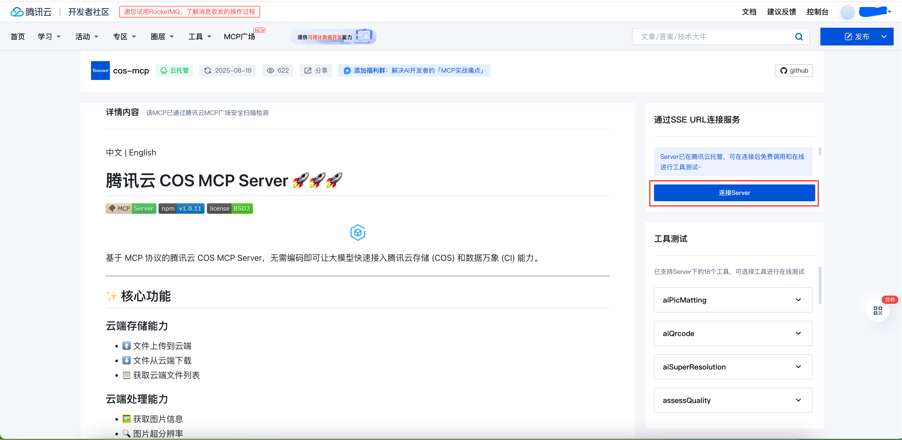
    3.  同意 **腾讯云开发者MCP广场软件许可及服务协议** 并继续
        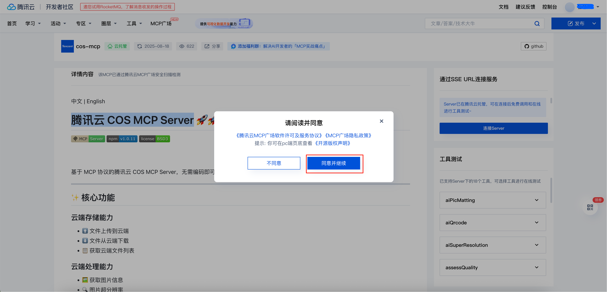
    4.  输入必填参数，点击 **连接Server** 创建 SSE URL
    
        填入必填参数，其中 `Region` 是托管服务所在地域`Bucket` 为托管服务存储桶名,从[腾讯云对象存储](https://console.cloud.tencent.com/cos)获取和购买对应产品，
    
        从 [API密钥管理](https://console.cloud.tencent.com/cam/capi) 获取、生成 SecretID 和 SecretKey
        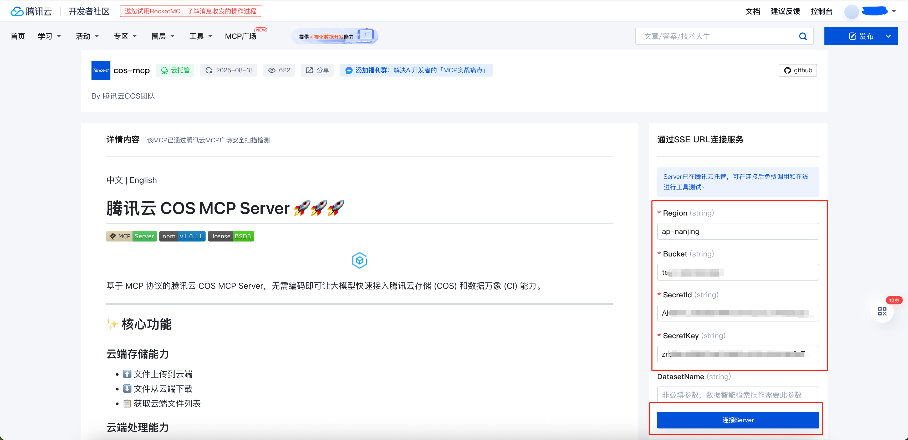
        生成 SSE URL 请妥善保存，勿泄露。
        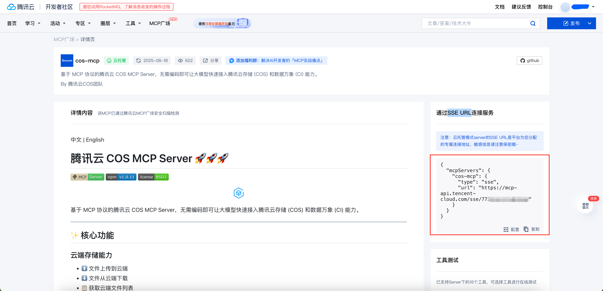

2.  云上测试
    1.  选择对应的工具 点击 **去测试**
        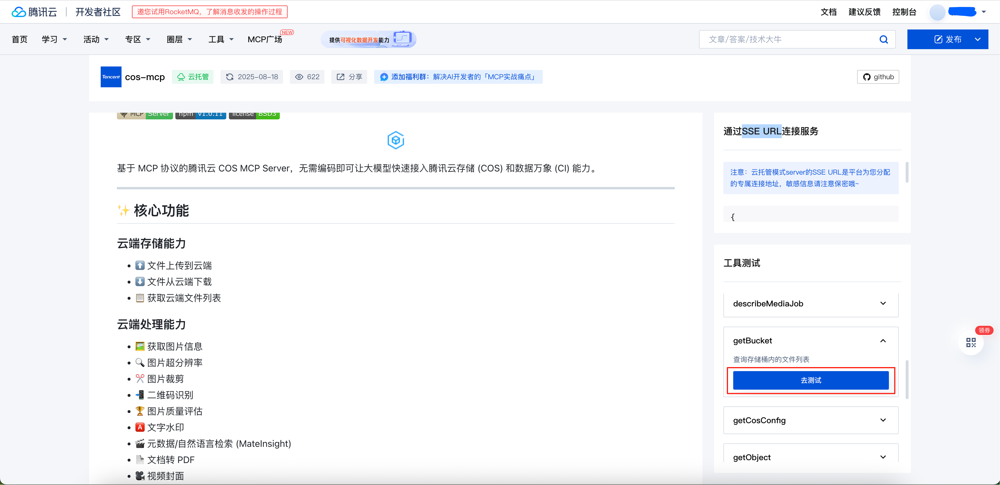
        测试结果如下图所示，表明线上配置成功
        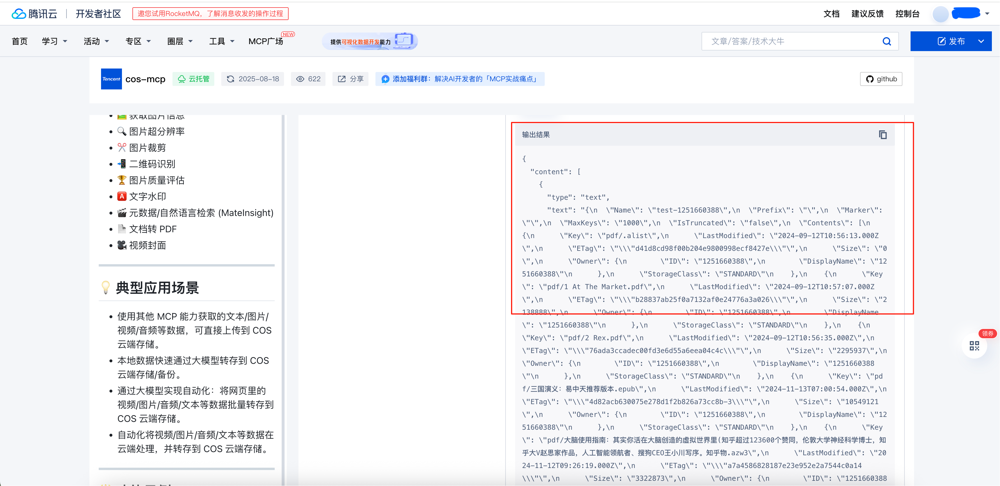
3.  IDE 上配置托管服务，以 CodeBuddy 为例
    1.  打开IDE的设置，找到 CodeBuddy 下的手动配置
        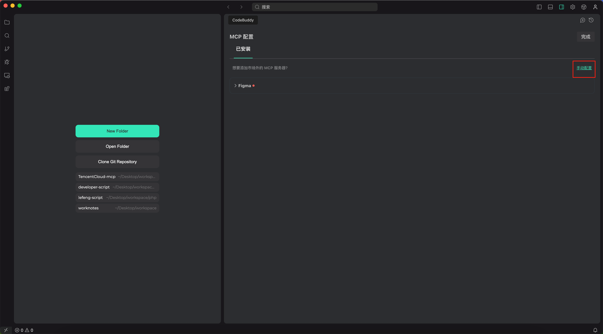
        添加MCP服务配置为云托管服务生成的配置
        ```json
        {
            "mcpServers": {
                "cos-mcp": {
                    "type": "sse",
                    "url": "https://mcp-api.tencent-cloud.com/sse/<your-token>" // 云托管生成的 SSE URL 替换为自己的 token
                }
            }
        }
        ```
        修改后如下图
        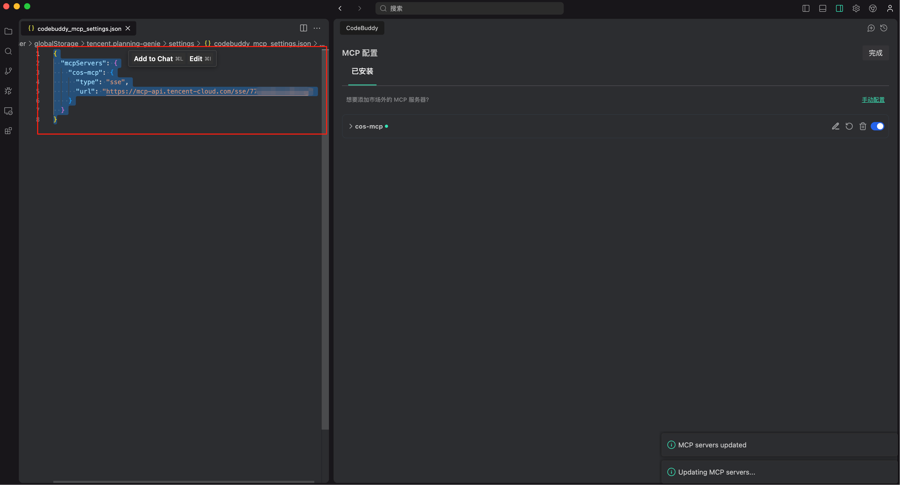
4.  IDE 上使用云托管模式的 MCP 服务
    1.  CodeBuddy上输入 **帮我查看下我的对象存储中有什么文件** 进行使用 COS MCP 服务

        **注意**:对话模式选择 **Craft**, chat 模式不会调用 MCP 服务
        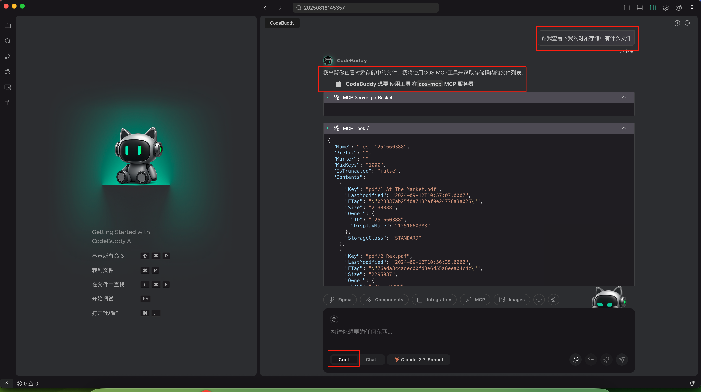   
        Codebuddy 对内容进行总结
        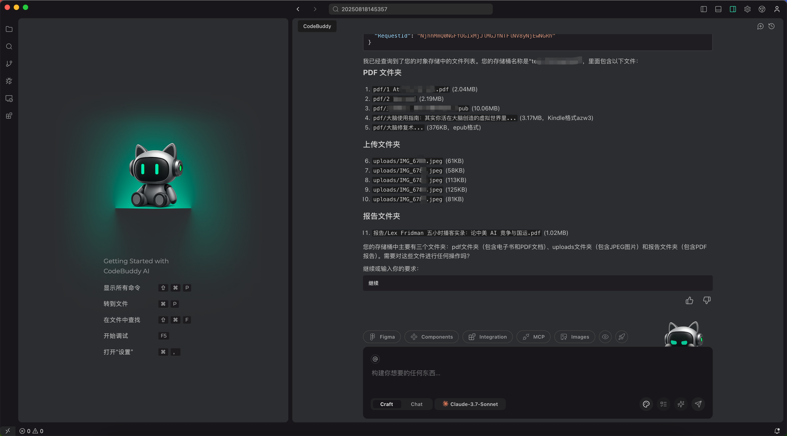
5.  更多
    1.  **[腾讯云云开发者社区 MCP 广场](https://cloud.tencent.com/developer/mcp)** 上的其他云托管模式 MCP 均可参考该使用步骤进行操作。
    
        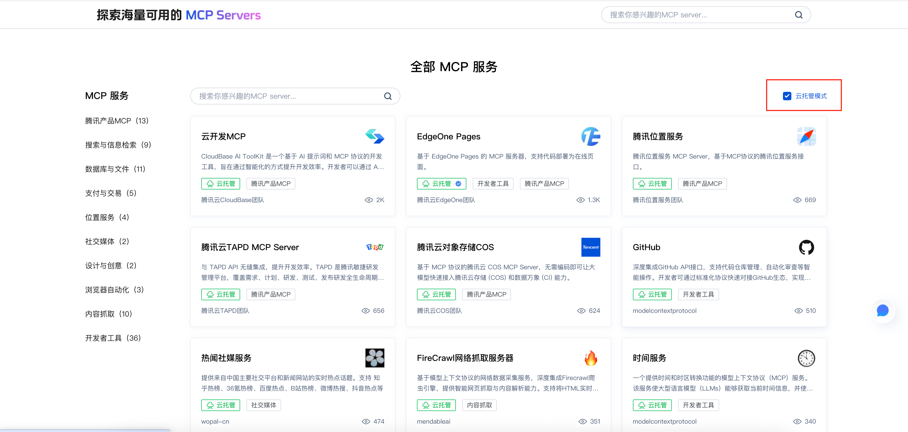
</details>

### 本地 MCP 服务安装与设置
通常对于 go 源码类的 MCP，您可以:
<details>
<summary>点击查看 go 源码类的 MCP 安装与设置</summary>

1.  可以从 [golang](https://golang.org/dl/) 安装 `go`， 版本 >= 1.24.1，如已安装跳过该步骤。
2.  以 **域名MCP** 为例，终端输入 `cd src/domain` 进入 源码目录
3.  执行 `go build` 进行源码编译, 得到可执行文件 **domain_server**
4.  执行 `./domain_server` 运行 MCP 服务
5.  拷贝 **步骤4** 输出的配置信息，在 IDE 中进行配置
    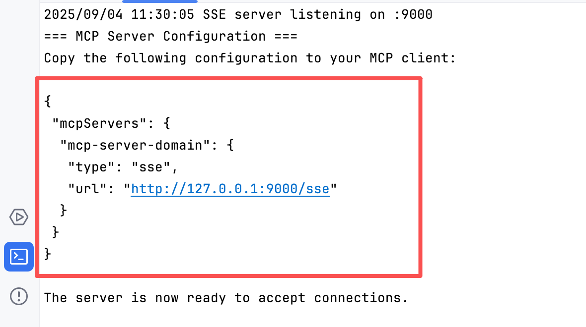
</details>

通常对于 command 为 uvx 的MCP，您可以：

<details>
<summary>点击查看 command 为 uvx 的 MCP 安装与设置</summary>

1. 可以从 [Astral](https://docs.astral.sh/uv/getting-started/installation/) 安装依赖 `uvx`

2.  将您选好的 MCP 服务添加到 MCP 客户端配置中

3.  根据 MCP 服务的参数和环境变量要求，配置好相关依赖参数

    以 **tencent-cvm** 为例，在 codebuddy_mcp_settings.json 中 增加 **tencent-cvm** 配置即可正常使用
    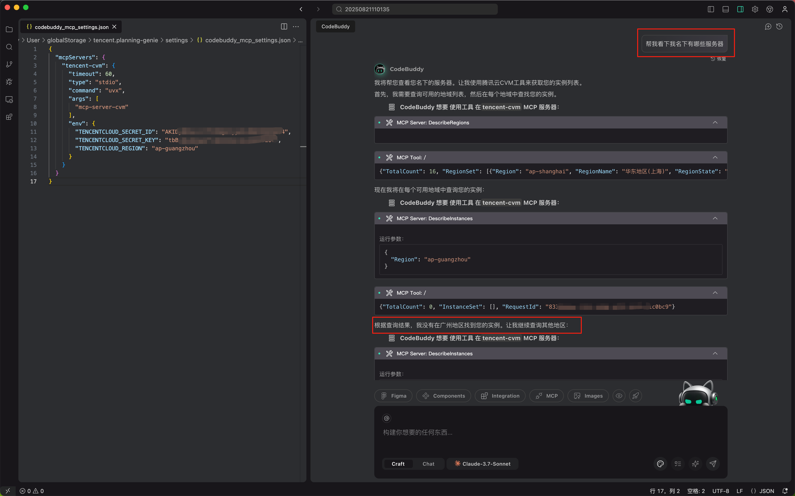

    command 为 uvx 的腾讯云 stdio 模式 MCP 配置示例：
    ```json
    {
      "mcpServers":{
        "mcp-server-tapd": {
            "command": "uvx",
            "args": [
                "mcp-server-tapd"
            ],
            "env": {
                "TAPD_API_USER": "",
                "TAPD_API_PASSWORD": "",
                "TAPD_API_BASE_URL": "https://api.tapd.cn",
                "TAPD_BASE_URL": "https://www.tapd.cn",
                "BOT_URL": ""
            }
        },
        "tencent-cvm": {
            "command": "uvx",
            "args": [
                "mcp-server-cvm"
            ],
            "env": {
                "TENCENTCLOUD_SECRET_ID": "YOUR_SECRET_ID_HERE",
                "TENCENTCLOUD_SECRET_KEY": "YOUR_SECRET_KEY_HERE",
                "TENCENTCLOUD_REGION": "YOUR_REGION_HERE"
            }
        },
        "tencent-tat": {
            "command": "uvx",
            "args": [
                "mcp-server-tat"
            ],
            "env": {
                "TENCENTCLOUD_SECRET_ID": "YOUR_SECRET_ID_HERE",
                "TENCENTCLOUD_SECRET_KEY": "YOUR_SECRET_KEY_HERE",
                "TENCENTCLOUD_REGION": "YOUR_REGION_HERE"
            }
        },
        "tencent-as": {
            "command": "uvx",
            "args": [
                "mcp-server-as"
            ],
            "env": {
                "TENCENTCLOUD_SECRET_ID": "YOUR_SECRET_ID_HERE",
                "TENCENTCLOUD_SECRET_KEY": "YOUR_SECRET_KEY_HERE",
                "TENCENTCLOUD_REGION": "YOUR_REGION_HERE"
            }
        }
      }
    }
    ```
</details>

对于 command 为 npx 的MCP，您可以：

<details>
<summary>点击查看 command 为 npx 的 MCP 安装与设置</summary>

1.  可以从 [Node.js](https://nodejs.org) 下载安装 node，安装完 node 同时会安装好依赖 npx
    
2.  将您选好的 MCP 服务添加到 MCP 客户端配置中

3.  根据 MCP 服务的参数和环境变量要求，配置好相关依赖参数

    以 **cos-mcp** 为例，在 codebuddy_mcp_settings.json 中 增加 **cos-mcp** 配置即可正常使用

    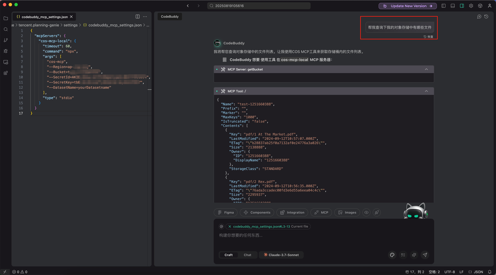
    
    command 为 npx 的腾讯云 stdio 模式 MCP 配置示例：
    ```json
    {
      "mcpServers": {
        "edgeone-pages-mcp-server": {
            "command": "npx",
            "args": [
                "edgeone-pages-mcp"
            ],
            "env": {
                "EDGEONE_PAGES_API_TOKEN": "",
                "EDGEONE_PAGES_PROJECT_NAME": ""
            }
        },
        "cos-mcp": {
            "command": "npx",
            "args": [
                "cos-mcp"
            ]
        },
        "cloudbase": {
            "command": "npx",
            "args": [
                "npm-global-exec@latest",
                "@cloudbase/cloudbase-mcp@latest"
            ],
            "env": {
                "INTEGRATION_IDE": "TencentMCPMarket"
            }
        },
        "tca-mcp-server": {
            "command": "npx",
            "args": [
                "-y",
                "-p",
                "tca-mcp-server@latest",
                "tca-mcp-stdio"
            ],
            "env": {
                "TCA_TOKEN": "<TCA_TOKEN>",
                "TCA_USER_NAME": "<TCA_USER_NAME>"
            }
        },
        "cnb": {
            "command": "npx",
            "args": [
                "-y",
                "-p",
                "@cnbcool/mcp-server",
                "cnb-mcp-stdio"
            ],
            "env": {
                "API_BASE_URL": "<BASE_URL>",
                "API_TOKEN": "<YOUR_TOKEN>"
            }
        },
        "coding-devops": {
            "command": "npx",
            "args": [
                "-y",
                "coding-devops-mcp-server"
            ],
            "env": {
                "CODING_TOKEN": "xxxxxxxxxxxxxx"
            },
            "disabled": false,
            "autoApprove": []
        },
      }
    }
    ```
</details>

请参阅各个服务器的 README 文件了解特定要求和配置选项。

##  各 IDE 安装与设置
### CodeBuddy 入门

<details>
<summary>点击查看 CodeBuddy 入门</summary>

1. 按照上面**安装与设置**部分的步骤，从 [Astral](https://docs.astral.sh/uv/getting-started/installation/) 安装 `uv`
2. 按照上面**安装与设置**部分的步骤，从 [Node.js](https://nodejs.org) 安装 node。
3. 您可以将 MCP 配置放在两个位置，具体取决于您的使用场景：
  A. **全局配置**
    - 对于您想在所有项目中使用的工具，在您的主目录中创建 `~/Library/Application Support/CodeBuddy/User/globalStorage/tencent.planning-genie/settings/codebuddy_mcp_settings.json` 文件。
    - 这使 MCP 服务在所有 CodeBuddy 工作区中可用。

#### `codebuddy_mcp_settings.json`

```json
{
  "mcpServers": {
    "cloudbase": {
      "command": "npx",
      "args": ["npm-global-exec@latest", "@cloudbase/cloudbase-mcp@latest"]
    }
  }
}
```
</details>

### Cursor 入门

<details>
<summary>点击查看 Cursor 入门</summary>

1. 按照上面**安装与设置**部分的步骤，从 [Astral](https://docs.astral.sh/uv/getting-started/installation/) 安装 `uv`
2. 按照上面**安装与设置**部分的步骤，从 [Node.js](https://nodejs.org) 安装 node。
3. 您可以将 MCP 配置放在两个位置，具体取决于您的使用场景：

  A. **项目配置**
    - 对于特定于项目的工具，在项目目录中创建 `.cursor/mcp.json` 文件。
    - 这允许您定义仅在该特定项目中可用的 MCP 服务。

  B. **全局配置**
    - 对于您想在所有项目中使用的工具，在您的主目录中创建 `~/.cursor/mcp.json` 文件。
    - 这使 MCP 服务在所有 Cursor 工作区中可用。

#### `.cursor/mcp.json`

```json
{
  "mcpServers": {
    "cloudbase": {
      "command": "npx",
      "args": ["npm-global-exec@latest", "@cloudbase/cloudbase-mcp@latest"]
    }
  }
}
```

3. **在聊天中使用 MCP** 如果 Composer Agent 确定 MCP 设置页面上列出的可用工具相关，它将自动使用这些工具。要有意提示工具使用，请提示 Cursor 使用您希望使用的 TencentCloud MCP 服务。例如，`使用 COS MCP 服务，做...`

4. **工具批准** 默认情况下，当 Agent 想要使用 MCP 工具时，它会显示一条消息请求您的批准。您可以使用工具名称旁边的箭头展开消息，查看 Agent 调用工具的参数。

</details>

### Windsurf 入门

<details>
<summary>点击查看 Windsurf 入门</summary>

1. 按照上面**安装与设置**部分的步骤，从 [Astral](https://docs.astral.sh/uv/getting-started/installation/) 安装 `uv`
2. 按照上面**安装与设置**部分的步骤，从 [Node.js](https://nodejs.org) 安装 node。

3. **访问 MCP 设置**
   - 导航至 Windsurf - 设置 > 高级设置或使用命令面板 > 打开 Windsurf 设置页面
   - 查找"模型上下文协议 (MCP) 服务"部分

4. **添加 MCP 服务**
   - 点击"添加服务"添加新的 MCP 服务
   - 您可以从可用模板中选择，如 GitHub、Puppeteer、PostgreSQL 等
   - 或者，点击"添加自定义服务"配置您自己的服务

5. **手动配置**
   - 您也可以手动编辑位于 `~/.codeium/windsurf/mcp_config.json` 的 MCP 配置文件

#### `~/.codeium/windsurf/mcp_config.json`

```json
{
  "mcpServers": {
    "cloudbase": {
      "command": "npx",
      "args": ["npm-global-exec@latest", "@cloudbase/cloudbase-mcp@latest"]
    }
  }
}
```

</details>

### VS Code 入门

<details>
<summary>点击查看 在 VS Code 中安装</summary>

1. 按照上面**安装与设置**部分的步骤，从 [Astral](https://docs.astral.sh/uv/getting-started/installation/) 安装 `uv`
2. 按照上面**安装与设置**部分的步骤，从 [Node.js](https://nodejs.org) 安装 node。

在 VS Code 设置或 `.vscode/mcp.json` 中配置 MCP 服务（更多信息请参阅 [VS Code MCP 文档](https://code.visualstudio.com/docs/copilot/chat/mcp-servers)）：

#### `.vscode/mcp.json`

```json
{
  "mcpServers": {
    "cloudbase": {
      "command": "npx",
      "args": ["npm-global-exec@latest", "@cloudbase/cloudbase-mcp@latest"]
    }
  }
}
```
</details>

##  更多资讯
1.  [官方精选MCP提效实践教程](https://cloud.tencent.com/developer/special/mcp)
2.  扫码进入 MCP 微信交流群
    
    

    群满或二维码失效请联系:

    