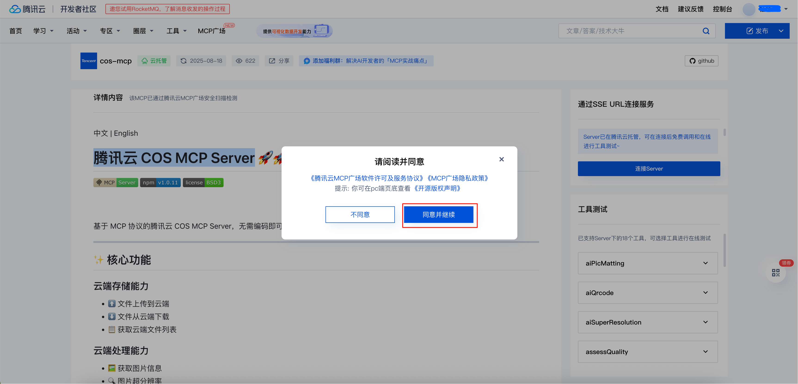
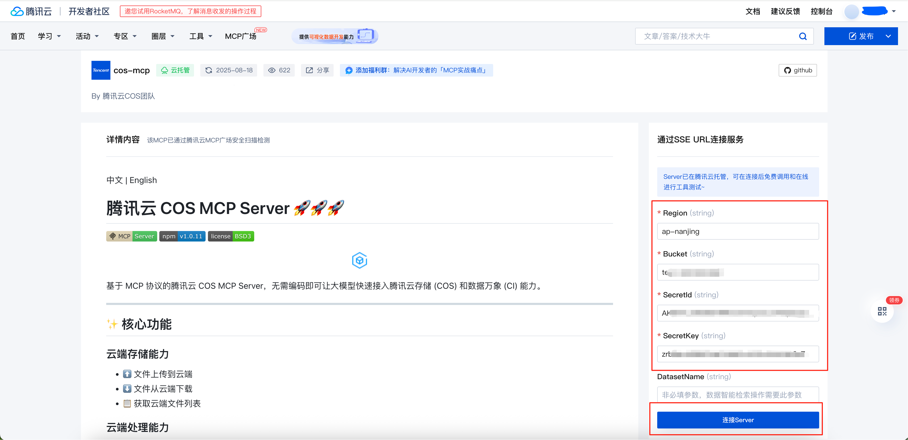
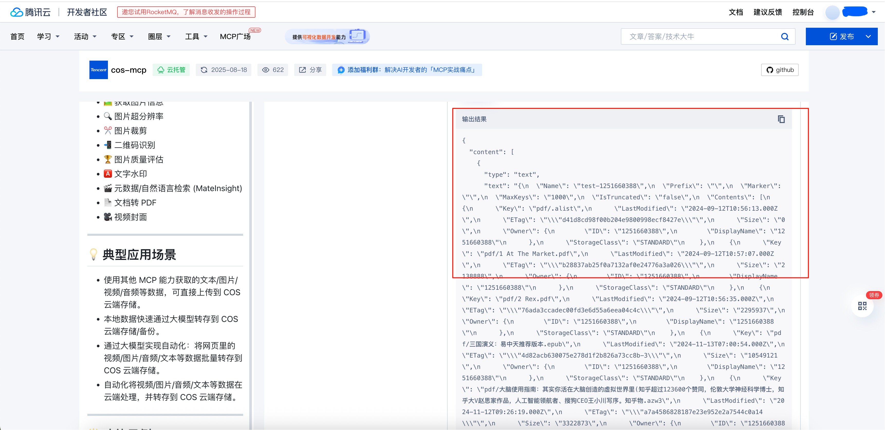
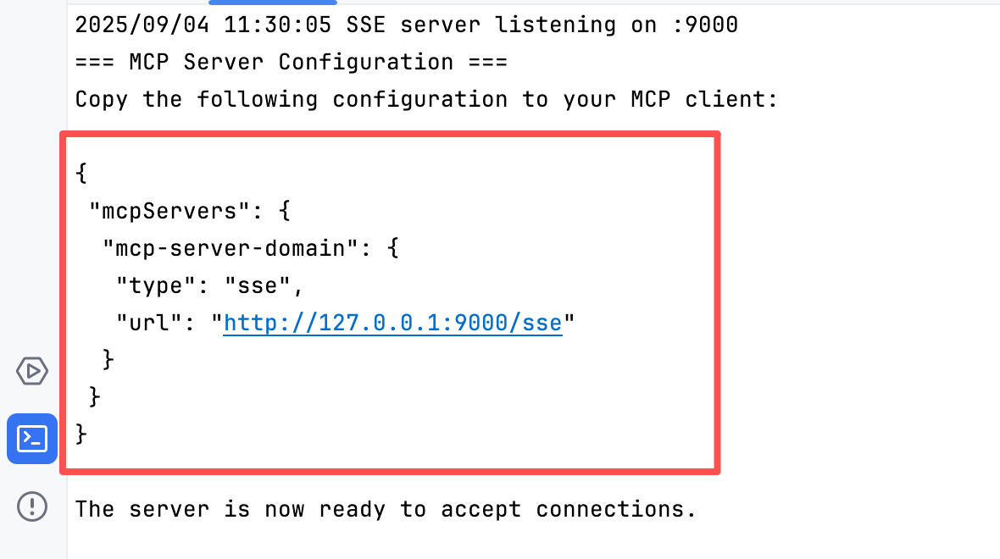

# TencentCloud MCP Servers

A suite of specialized MCP servers that help you get the most out of TencentCloud. Build cloud-native applications, manage infrastructure, and accelerate AI development and deployment wherever you use MCP.

[](LICENSE)

**🌍 Languages:**  **English** | [中文](README-ZH.md) 

## Table of Contents

- [TencentCloud MCP Servers](#tencentcloud-mcp-servers)
  - [Table of Contents](#table-of-contents)
  - [What is the Model Context Protocol (MCP) and how does it work with TencentCloud MCP Servers?](#what-is-the-model-context-protocol-mcp-and-how-does-it-work-with-tencentcloud-mcp-servers)
    - [Why TencentCloud MCP Servers?](#why-tencentcloud-mcp-servers)
  - [Available MCP Servers: Quick Installation](#available-mcp-servers-quick-installation)
    - [Project Management](#Project-Management)
    - [Development Efficiency](#Development-Efficiency)
    - [SaaS](#SaaS)
    - [PaaS](#PaaS)
    - [IaaS](#IaaS)
  - [When to use Local vs Remote MCP Servers?](#when-to-use-local-vs-remote-mcp-servers)
    - [Local MCP Servers](#local-mcp-servers)
    - [Remote MCP Servers](#remote-mcp-servers)
  - [Remote and Local Installation & Setup](#remote-and-local-installation--setup)
    - [Steps for Using Remote Hosted MCP](#steps-for-using-remote-hosted-mcp)
    - [Steps for Local Installation of MCP](#steps-for-local-installation-of-mcp)
  - [Installation and Setup](#installation-and-setup)
    - [Getting Started with CodeBuddy](#getting-started-with-codebuddy)
      - [`codebuddy_mcp_settings.json`](#codebuddymcpsettingsjson)
    - [Getting Started with Cursor](#getting-started-with-cursor)
      - [`.cursor/mcp.json`](#cursormcpjson)
    - [Getting Started with Windsurf](#getting-started-with-windsurf)
      - [`~/.codeium/windsurf/mcp_config.json`](#codeiumwindsurfmcp_configjson)
    - [Getting Started with VS Code](#getting-started-with-vs-code)
      - [`.vscode/mcp.json`](#vscodemcpjson)


## What is the Model Context Protocol (MCP) and how does it work with TencentCloud MCP Servers?

> The Model Context Protocol (MCP) is an open protocol that enables seamless integration between LLM applications and external data sources and tools. Whether you're building an AI-powered IDE, enhancing a chat interface, or creating custom AI workflows, MCP provides a standardized way to connect LLMs with the context they need.
>
> &mdash; [Model Context Protocol README](https://github.com/modelcontextprotocol#:~:text=The%20Model%20Context,context%20they%20need.)

An MCP Server is a lightweight program that exposes specific capabilities through the standardized Model Context Protocol. Host applications (such as chatbots, IDEs, and other AI tools) have MCP clients that maintain 1:1 connections with MCP servers. Common MCP clients include agentic AI coding assistants (like CodeBuddy, Cursor, Q Developer, Cline, Windsurf) as well as chatbot applications like Claude Desktop, with more clients coming soon. MCP servers can access local data sources and remote services to provide additional context that improves the generated outputs from the models.

TencentCloud MCP Servers use this protocol to provide AI applications access to TencentCloud documentation, contextual guidance, and best practices. Through the standardized MCP client-server architecture, TencentCloud capabilities become an intelligent extension of your development environment or AI application.

TencentCloud MCP servers enable enhanced cloud-native development, infrastructure management, and development workflows—making AI-assisted cloud computing more accessible and efficient.

The Model Context Protocol is an open source project run by Anthropic, PBC. and open to contributions from the entire community. For more information on MCP, you can find further documentation [here](https://modelcontextprotocol.io/introduction)

## Why TencentCloud MCP Servers?

MCP servers enhance the capabilities of foundation models (FMs) in several key ways:

- **Improved Output Quality**: By providing relevant information directly in the model's context, MCP servers significantly improve model responses for specialized domains like TencentCloud services. This approach reduces hallucinations, provides more accurate technical details, enables more precise code generation, and ensures recommendations align with current TencentCloud best practices and service capabilities.

- **Access to Latest Documentation**: FMs may not have knowledge of recent releases, APIs, or SDKs. MCP servers bridge this gap by pulling in up-to-date documentation, ensuring your AI assistant always works with the latest TencentCloud capabilities.

- **Workflow Automation**: MCP servers convert common workflows into tools that foundation models can use directly.

- **Specialized Domain Knowledge**: MCP servers provide deep, contextual knowledge about TencentCloud services that might not be fully represented in foundation models' training data, enabling more accurate and helpful responses for cloud development tasks.

## Available MCP Servers: Quick Installation

MCP Server List Sync With **[TencentCloud Developer MCP Market](https://mc.tencent.com/IZhJGPPS)**.

Get started quickly with one-click installation buttons for popular MCP clients. Click the buttons below to install servers directly in CodeBuddy, Cursor or VS Code:

1.  If you are using **Cursor** for local deployment, click  in the list for quick installation.

2.  If you are using **VS Code** for local deployment, click  in the list for quick installation.

3.  If you are using **Hosted** Deployment mode, click  in the list for quick installation.

### Project Management
| Server Name | Description | Install | Hosted |
|-------------|-------------|---------|:-------:|
| [Tencent Cloud TAPD MCP Server](src/mcp-server-tapd) | Seamless integration with the TAPD API to enhance development efficiency. TAPD is Tencent's Agile R&D Management Platform, covering the entire lifecycle of development from requirements and planning to development, testing, and release. It supports natural language conversations with TAPD, enabling the management of requirements, defects, tasks, iterations, and more. | [](https://cursor.com/en/install-mcp?name=mcp-server-tapd&config=eyJjb21tYW5kIjoidXZ4IG1jcC1zZXJ2ZXItdGFwZCIsImRpc2FibGVkIjpmYWxzZSwiYXV0b0FwcHJvdmUiOltdLCJlbnYiOnsiVEFQRF9BUElfVVNFUiI6IiIsIlRBUERfQVBJX1BBU1NXT1JEIjoiIiwiVEFQRF9BUElfQkFTRV9VUkwiOiJodHRwczpcL1wvYXBpLnRhcGQuY24iLCJUQVBEX0JBU0VfVVJMIjoiaHR0cHM6XC9cL3d3dy50YXBkLmNuIiwiQk9UX1VSTCI6IiJ9fQ%3D%3D) <br/> [](https://insiders.vscode.dev/redirect/mcp/install?name=mcp-server-tapd&config=%7B%22command%22%3A%22uvx%22%2C%22args%22%3A%5B%22mcp-server-tapd%22%5D%2C%22env%22%3A%7B%22TAPD_API_USER%22%3A%22%22%2C%22TAPD_API_PASSWORD%22%3A%22%22%2C%22TAPD_API_BASE_URL%22%3A%22https%3A%5C%2F%5C%2Fapi.tapd.cn%22%2C%22TAPD_BASE_URL%22%3A%22https%3A%5C%2F%5C%2Fwww.tapd.cn%22%2C%22BOT_URL%22%3A%22%22%7D%7D) | [](https://cloud.tencent.com/developer/mcp/server/11474) |
| [CNB MCP Server](src/cnb-mcp-server) | The CNB MCP Server is a large language model toolkit that supports the MCP protocol, designed to communicate via standard input/output (STDIO). Users can start the server by configuring `mcpServers`, specifying the API base URL and access token. This server requires Node.js version 18 or higher and provides a detailed development guide, including installing dependencies, generating type definitions, configuring environment variables, and building the project. Additionally, users can utilize the `@modelcontextprotocol/inspector` tool for previewing and debugging. The primary purpose of this server is to offer developers a flexible and extensible interface for interacting with CNB's large language models. | [](https://cursor.com/en/install-mcp?name=cnb&config=eyJjb21tYW5kIjoibnB4IC15IC1wIEBjbmJjb29sXC9tY3Atc2VydmVyIGNuYi1tY3Atc3RkaW8iLCJkaXNhYmxlZCI6ZmFsc2UsImF1dG9BcHByb3ZlIjpbXSwiZW52Ijp7IkFQSV9CQVNFX1VSTCI6IjxCQVNFX1VSTD4iLCJBUElfVE9LRU4iOiI8WU9VUl9UT0tFTj4ifX0%3D) <br/> [](https://insiders.vscode.dev/redirect/mcp/install?name=cnb&config=%7B%22command%22%3A%22npx%22%2C%22args%22%3A%5B%22-y%22%2C%22-p%22%2C%22%40cnbcool%5C%2Fmcp-server%22%2C%22cnb-mcp-stdio%22%5D%2C%22env%22%3A%7B%22API_BASE_URL%22%3A%22%3CBASE_URL%3E%22%2C%22API_TOKEN%22%3A%22%3CYOUR_TOKEN%3E%22%7D%7D) | [](https://cloud.tencent.com/developer/mcp/server/11716) |

### Development Efficiency
| Server Name | Description | Install | Hosted |
|-------------|-------------|---------|:-------:|
| [CloudBase AI ToolKit](src/CloudBase-AI-ToolKit) | The **CloudBase AI ToolKit** is an integrated development environment (IDE) designed to streamline the creation, deployment, and hosting of full-stack web applications, mini-programs, databases, and backend services using AI. It supports multiple languages and platforms, offering features like AI-driven code generation, seamless cloud development integration, and rapid deployment. The toolkit includes pre-configured project templates for various frameworks (e.g., React, Vue, UniApp) and supports AI tools. With its plugin-based architecture, it enables environment management, database operations, cloud function management, and static hosting. The toolkit also provides intelligent debugging, fast CDN access, and a built-in knowledge base for efficient development. | [](https://cursor.com/en/install-mcp?name=cloudbase&config=eyJjb21tYW5kIjoibnB4IG5wbS1nbG9iYWwtZXhlY0BsYXRlc3QgQGNsb3VkYmFzZVwvY2xvdWRiYXNlLW1jcEBsYXRlc3QiLCJkaXNhYmxlZCI6ZmFsc2UsImF1dG9BcHByb3ZlIjpbXSwiZW52Ijp7IklOVEVHUkFUSU9OX0lERSI6IlRlbmNlbnRNQ1BNYXJrZXQifX0%3D) <br/> [](https://insiders.vscode.dev/redirect/mcp/install?name=cloudbase&config=%7B%22command%22%3A%22npx%22%2C%22args%22%3A%5B%22npm-global-exec%40latest%22%2C%22%40cloudbase%5C%2Fcloudbase-mcp%40latest%22%5D%2C%22env%22%3A%7B%22INTEGRATION_IDE%22%3A%22TencentMCPMarket%22%7D%7D) | [](https://cloud.tencent.com/developer/mcp/server/11698) |
| [Tencent Cloud Code Analysis (TCA) MCP Server​](src/tca-mcp-server) | Tencent Cloud Code Analysis MCP Server, based on the MCP protocol, accurately tracks and manages code quality defects, code standards, code security vulnerabilities, and ineffective code discovered through code analysis. It also measures code complexity, duplicate code, and code statistics.  | [](https://cursor.com/en/install-mcp?name=tca-mcp-server&config=eyJjb21tYW5kIjoibnB4IC15IC1wIHRjYS1tY3Atc2VydmVyQGxhdGVzdCB0Y2EtbWNwLXN0ZGlvIiwiZGlzYWJsZWQiOmZhbHNlLCJhdXRvQXBwcm92ZSI6W10sImVudiI6eyJUQ0FfVE9LRU4iOiI8VENBX1RPS0VOPiIsIlRDQV9VU0VSX05BTUUiOiI8VENBX1VTRVJfTkFNRT4ifX0%3D) <br/> [](https://insiders.vscode.dev/redirect/mcp/install?name=tca-mcp-server&config=%7B%22command%22%3A%22npx%22%2C%22args%22%3A%5B%22-y%22%2C%22-p%22%2C%22tca-mcp-server%40latest%22%2C%22tca-mcp-stdio%22%5D%2C%22env%22%3A%7B%22TCA_TOKEN%22%3A%22%3CTCA_TOKEN%3E%22%2C%22TCA_USER_NAME%22%3A%22%3CTCA_USER_NAME%3E%22%7D%7D) | [](https://cloud.tencent.com/developer/mcp/server/11709) |
| [TDesign MCP Server](src/tdesign-mcp-server) | The TDesign MCP Server is a robust tool designed to support the development and utilization of component libraries. It offers four core functionalities: 1) `get-component-changelog` for retrieving component change logs, aiding developers in version upgrades; 2) `get-component-docs` to provide component documentation, assisting in code generation and transformation; 3) `get-component-dom` to obtain the DOM structure of components, facilitating custom CSS styling; and 4) `get-component-list` to enumerate all available components, helping developers select and combine components to implement new features. With a simple JSON configuration, developers can easily launch and utilize this server. | [](https://cursor.com/en/install-mcp?name=&config=W10%3D) <br/> [](https://insiders.vscode.dev/redirect/mcp/install?name=&config=%5B%5D) | [](https://cloud.tencent.com/developer/mcp/server/11721) |
| [CODING DevOps MCP Server](src/coding_devops_mcp_server) | CODING DevOps MCP Server is an implementation based on the Model Context Protocol (MCP), designed to seamlessly integrate with the CODING DevOps platform. It provides a standardized set of interfaces, enabling users to efficiently manage projects, work items, and code. Key features include project management (e.g., creating, deleting, and searching for projects), work item management (e.g., creating, deleting, and breaking down work items), and code management (e.g., commit history queries and merge request management). Additionally, it supports intelligent Git integration and optimizes merge request workflows, enhancing the automation capabilities of code management. The server is designed with a focus on user-friendliness, offering detailed error handling and flexible configuration support to help users quickly identify and resolve issues. Through environment variables and project-level defaults, users can easily configure the server to meet diverse requirements. | [](https://cursor.com/en/install-mcp?name=coding-devops&config=eyJjb21tYW5kIjoibnB4IC15IGNvZGluZy1kZXZvcHMtbWNwLXNlcnZlciIsImRpc2FibGVkIjpmYWxzZSwiYXV0b0FwcHJvdmUiOltdLCJlbnYiOnsiQ09ESU5HX1RPS0VOIjoieHh4eHh4eHh4eHh4eHgifX0%3D) <br/> [](https://insiders.vscode.dev/redirect/mcp/install?name=coding-devops&config=%7B%22command%22%3A%22npx%22%2C%22args%22%3A%5B%22-y%22%2C%22coding-devops-mcp-server%22%5D%2C%22env%22%3A%7B%22CODING_TOKEN%22%3A%22xxxxxxxxxxxxxx%22%7D%2C%22disabled%22%3Afalse%2C%22autoApprove%22%3A%5B%5D%7D) |[](https://cloud.tencent.com/developer/mcp/server/11722) |

### SaaS
| Server Name | Description | Install | Hosted |
|-------------|-------------|---------|:-------:|
| DNSpod MCP Server | The Tencent Cloud DNS MCP server is implemented to manage authoritative DNS domains and obtain DNS resolution statistics. | No Support |  [](https://cloud.tencent.com/developer/mcp/server/11743) |
| [Domain MCP](src/domain) | The method of acquiring a domain name is through paid acquisition of the usage rights for one or multiple years, which we refer to as domain registration.| [Install Go Source](#mcp-servers-with-go-source-you-can-typically) |  [](https://cloud.tencent.com/developer/mcp/server/11749) |
| Private DNS MCP | The MCP server, leveraging Private DNS, supports rapid creation of private zones and viewing of private zone resolution details.| No Support |  [](https://cloud.tencent.com/developer/mcp/server/11756) |

### PaaS
| Server Name | Description | Install | Hosted |
|-------------|-------------|---------|:-------:|
| [EdgeOne Pages MCP](src/edgeone-pages-mcp) | The MCP server based on EdgeOne Pages supports code deployment as an online page. | [](https://cursor.com/en/install-mcp?name=edgeone-pages-mcp-server&config=eyJjb21tYW5kIjoibnB4IGVkZ2VvbmUtcGFnZXMtbWNwIiwiZGlzYWJsZWQiOmZhbHNlLCJhdXRvQXBwcm92ZSI6W10sImVudiI6eyJFREdFT05FX1BBR0VTX0FQSV9UT0tFTiI6IiIsIkVER0VPTkVfUEFHRVNfUFJPSkVDVF9OQU1FIjoiIn19) <br/> [](https://insiders.vscode.dev/redirect/mcp/install?name=edgeone-pages-mcp-server&config=%7B%22command%22%3A%22npx%22%2C%22args%22%3A%5B%22edgeone-pages-mcp%22%5D%2C%22env%22%3A%7B%22EDGEONE_PAGES_API_TOKEN%22%3A%22%22%2C%22EDGEONE_PAGES_PROJECT_NAME%22%3A%22%22%7D%7D) | [](https://cloud.tencent.com/developer/mcp/server/10011) |
| [mcp-server-tat](src/mcp-server-tat) | TencentCloud TAT (TencentCloud Automation Tools) MCP Server, used to execute commands directly on Tencent Cloud instances in MCP-supported clients. | [](https://cursor.com/en/install-mcp?name=tencent-tat&config=eyJjb21tYW5kIjoidXZ4IG1jcC1zZXJ2ZXItdGF0IiwiZGlzYWJsZWQiOmZhbHNlLCJhdXRvQXBwcm92ZSI6W10sImVudiI6eyJURU5DRU5UQ0xPVURfU0VDUkVUX0lEIjoiWU9VUl9TRUNSRVRfSURfSEVSRSIsIlRFTkNFTlRDTE9VRF9TRUNSRVRfS0VZIjoiWU9VUl9TRUNSRVRfS0VZX0hFUkUiLCJURU5DRU5UQ0xPVURfUkVHSU9OIjoiWU9VUl9SRUdJT05fSEVSRSJ9fQ%3D%3D) <br/> [](https://insiders.vscode.dev/redirect/mcp/install?name=tencent-tat&config=%7B%22command%22%3A%22uvx%22%2C%22args%22%3A%5B%22mcp-server-tat%22%5D%2C%22env%22%3A%7B%22TENCENTCLOUD_SECRET_ID%22%3A%22YOUR_SECRET_ID_HERE%22%2C%22TENCENTCLOUD_SECRET_KEY%22%3A%22YOUR_SECRET_KEY_HERE%22%2C%22TENCENTCLOUD_REGION%22%3A%22YOUR_REGION_HERE%22%7D%7D) | [](https://cloud.tencent.com/developer/mcp/server/11729) |
| [mcp-server-as](src/mcp-server-as) | Tencent Cloud AS MCP Server is a tool designed for managing Tencent Cloud Auto Scaling groups and related resources. Its primary functions encompass the full lifecycle management of Auto Scaling groups (including creation, modification, enabling, and disabling), the execution of scaling policies (supporting manual scaling up and down), and capacity management (modifying desired capacity). | [](https://cursor.com/en/install-mcp?name=tencent-as&config=eyJjb21tYW5kIjoidXZ4IG1jcC1zZXJ2ZXItYXMiLCJkaXNhYmxlZCI6ZmFsc2UsImF1dG9BcHByb3ZlIjpbXSwiZW52Ijp7IlRFTkNFTlRDTE9VRF9TRUNSRVRfSUQiOiJZT1VSX1NFQ1JFVF9JRF9IRVJFIiwiVEVOQ0VOVENMT1VEX1NFQ1JFVF9LRVkiOiJZT1VSX1NFQ1JFVF9LRVlfSEVSRSIsIlRFTkNFTlRDTE9VRF9SRUdJT04iOiJZT1VSX1JFR0lPTl9IRVJFIn19) <br/> [](https://insiders.vscode.dev/redirect/mcp/install?name=tencent-as&config=%7B%22command%22%3A%22uvx%22%2C%22args%22%3A%5B%22mcp-server-as%22%5D%2C%22env%22%3A%7B%22TENCENTCLOUD_SECRET_ID%22%3A%22YOUR_SECRET_ID_HERE%22%2C%22TENCENTCLOUD_SECRET_KEY%22%3A%22YOUR_SECRET_KEY_HERE%22%2C%22TENCENTCLOUD_REGION%22%3A%22YOUR_REGION_HERE%22%7D%7D) | [](https://cloud.tencent.com/developer/mcp/server/11730) |
| Tencent Cloud Log Service | Query log data stored in CLS (Cloud Log Service) through MCP Server to integrate the big model platform/tools with log data. For example, using natural language to query logs reduces the complexity of log queries; integrating it into O&M troubleshooting processes enables intelligent analysis of system anomalies. | No Support |  [](https://cloud.tencent.com/developer/mcp/server/11710) |
| [TencentDB for MySQL MCP](src/cdb) | TencentDB for MySQL provides users with secure, reliable, high-performance, and easily maintainable enterprise-grade cloud database services. | [Install Go Source](#mcp-servers-with-go-source-you-can-typically) |  [](https://cloud.tencent.com/developer/mcp/server/11744) |
| [TDSQL-C MySQL MCP](src/cynosdb) | TDSQL-C for MySQL is Tencent Cloud's self-developed next-generation cloud-native relational database. | [Install Go Source](#mcp-servers-with-go-source-you-can-typically) |  [](https://cloud.tencent.com/developer/mcp/server/11745) |
| [CDN MCP](src/cdn) | Content Delivery Network (CDN) distributes website content to a vast network of acceleration nodes deployed globally, enabling users to access required content from nearby locations and avoiding network instability and high access latency caused by network congestion.| [Install Go Source](#mcp-servers-with-go-source-you-can-typically) |  [](https://cloud.tencent.com/developer/mcp/server/11748) |
| [CLB MCP](src/clb) | Cloud Load Balancer (CLB) provides secure and efficient Layer 4 and Layer 7 traffic distribution services. Traffic routed through CLB is automatically distributed across multiple backend servers, thereby scaling system service capacity and eliminating single points of failure.| [Install Go Source](#mcp-servers-with-go-source-you-can-typically) |  [](https://cloud.tencent.com/developer/mcp/server/11747) |
| [SSL MCP](src/ssl) | Tencent Cloud SSL Certificates provides comprehensive services for SSL certificate application, management, and deployment, offering you a one-stop HTTPS solution.| [Install Go Source](#mcp-servers-with-go-source-you-can-typically) |  [](https://cloud.tencent.com/developer/mcp/server/11751) |
| [Live MCP](src/live) | Cloud Streaming Services (CSS) provides you with lightning-fast, reliable, and enterprise-grade cloud live streaming solutions.| [Install Go Source](#mcp-servers-with-go-source-you-can-typically) |  [](https://cloud.tencent.com/developer/mcp/server/11752) |
| [VOD MCP](src/vod) | Providing end-to-end, premium media services for audio, video, and images—from content creation and upload to storage, transcoding, AI-powered processing, accelerated distribution, playback, and copyright protection.| [Install Go Source](#mcp-servers-with-go-source-you-can-typically) |  [](https://cloud.tencent.com/developer/mcp/server/11753) |
| [TencentDB for Redis MCP](src/redis) | TencentDB for Redis® is a caching and storage service built by Tencent Cloud that is compatible with both Redis and Memcached protocols.| [Install Go Source](#mcp-servers-with-go-source-you-can-typically) |  [](https://cloud.tencent.com/developer/mcp/server/11755) |
| [TencentDB for MongoDB MCP](src/mongodb) | TencentDB for MongoDB is a high-performance NoSQL database built by Tencent Cloud based on the globally popular MongoDB, offering 100% full compatibility with the MongoDB protocol.| [Install Go Source](#mcp-servers-with-go-source-you-can-typically) |  [](https://cloud.tencent.com/developer/mcp/server/11757) |

### IaaS
| Server Name | Description | Install | Hosted |
|-------------|-------------|---------|:-------:|
| [COS MCP](src/cos-mcp) | The Tencent Cloud COS MCP Server is a tool designed to seamlessly integrate large models with Tencent Cloud's storage (COS) and data processing (CI) capabilities using the MCP protocol. It offers core functionalities such as file upload/download, image processing (e.g., super-resolution, cropping, QR code recognition), and metadata/natural language retrieval. Typical use cases include automated data transfer to COS, batch processing of web content, and cloud-based media transformation. Installation can be done via npm or source code, with options for local or remote (SSE) connections. Configuration requires parameters like SecretId, SecretKey, Bucket, and Region, ensuring secure and efficient data management. | [](https://cursor.com/en/install-mcp?name=cos-mcp&config=eyJjb21tYW5kIjoibnB4IGNvcy1tY3AiLCJkaXNhYmxlZCI6ZmFsc2UsImF1dG9BcHByb3ZlIjpbXX0%3D) <br/> [](https://insiders.vscode.dev/redirect/mcp/install?name=cos-mcp&config=%7B%22command%22%3A%22npx%22%2C%22args%22%3A%5B%22cos-mcp%22%5D%7D) |[](https://cloud.tencent.com/developer/mcp/server/11472) |
| [mcp-server-cvm](src/mcp-server-cvm) | Implementation of Tencent Cloud CVM (Cloud Virtual Machine) MCP server for managing Tencent Cloud instances and network resources. | [](https://cursor.com/en/install-mcp?name=tencent-cvm&config=eyJjb21tYW5kIjoidXZ4IG1jcC1zZXJ2ZXItY3ZtIiwiZGlzYWJsZWQiOmZhbHNlLCJhdXRvQXBwcm92ZSI6W10sImVudiI6eyJURU5DRU5UQ0xPVURfU0VDUkVUX0lEIjoiWU9VUl9TRUNSRVRfSURfSEVSRSIsIlRFTkNFTlRDTE9VRF9TRUNSRVRfS0VZIjoiWU9VUl9TRUNSRVRfS0VZX0hFUkUiLCJURU5DRU5UQ0xPVURfUkVHSU9OIjoiWU9VUl9SRUdJT05fSEVSRSJ9fQ%3D%3D) <br/> [](https://insiders.vscode.dev/redirect/mcp/install?name=tencent-cvm&config=%7B%22command%22%3A%22uvx%22%2C%22args%22%3A%5B%22mcp-server-cvm%22%5D%2C%22env%22%3A%7B%22TENCENTCLOUD_SECRET_ID%22%3A%22YOUR_SECRET_ID_HERE%22%2C%22TENCENTCLOUD_SECRET_KEY%22%3A%22YOUR_SECRET_KEY_HERE%22%2C%22TENCENTCLOUD_REGION%22%3A%22YOUR_REGION_HERE%22%7D%7D) | [](https://cloud.tencent.com/developer/mcp/server/11728) |
| Lighthouse MCP Server | An MCP (Model Context Protocol) server built on Tencent Cloud Lighthouse API for seamless AI model integration and cloud server management. | No Support |  [](https://cloud.tencent.com/developer/mcp/server/11473) |
| [CBS MCP](src/cbs) | Cloud Block Storage (CBS) provides persistent block-level storage services for your Cloud Virtual Machines (CVM).| [Install Go Source](#mcp-servers-with-go-source-you-can-typically) |  [](https://cloud.tencent.com/developer/mcp/server/11750) |

## When to use Local vs Remote MCP Servers?

TencentCloud MCP servers can be run either locally on your development machine or remotely on the cloud. Here's when to use each approach:

### Local MCP Servers
- **Development & Testing**: Perfect for local development, testing, and debugging
- **Offline Work**: Continue working when internet connectivity is limited
- **Data Privacy**: Keep sensitive data and credentials on your local machine
- **Low Latency**: Minimal network overhead for faster response times
- **Resource Control**: Direct control over server resources and configuration

### Remote MCP Servers
- **Team Collaboration**: Share consistent server configurations across your team
- **Always Available**: Access your MCP servers from anywhere, any device
- **Automatic Updates**: Get the latest features and security patches automatically
- **Scalability**: Easily handle varying workloads without local resource constraints

## Remote and Local Installation & Setup
### Steps for Using Remote Hosted MCP
<details>
<summary>Steps for Using Remote Hosted MCP</summary>

1.  Cloud Configuration
    1.  Visit the MCP details page in the **[Tencent Cloud Developer Community MCP Marketplace](https://mc.tencent.com/IZhJGPPS)**, using **[Tencent Cloud COS MCP Server](https://cloud.tencent.com/developer/mcp/server/11472)** as an example
    2.  Click the **Connect Server** button on the details page
        
    3.  Agree to the **Tencent Cloud Developer MCP Marketplace Software License and Service Agreement** and continue
        
    4.  Enter the required parameters and click **Connect Server** to create an SSE URL
    
        Fill in the required parameters, where `Region` is the location of the hosted service and `Bucket` is the name of the storage bucket for the hosted service. These can be obtained and purchased from [Tencent Cloud Object Storage](https://console.cloud.tencent.com/cos).
    
        Obtain or generate your SecretID and SecretKey from [API Key Management](https://console.cloud.tencent.com/cam/capi)
        
        Please securely store the generated SSE URL and do not disclose it.
        

2.  Cloud Testing
    1.  Select the corresponding tool and click **Test**
        
        The test results are shown in the image below, indicating that the online configuration was successful
        
3.  IDE Configuration for Hosted Services, using CodeBuddy as an example
    1.  Open the IDE settings and find the manual configuration under CodeBuddy
        
        Add the MCP service configuration using the configuration generated by the cloud hosting service
        ```json
        {
            "mcpServers": {
                "cos-mcp": {
                    "type": "sse",
                    "url": "https://mcp-api.tencent-cloud.com/sse/<your-token>" // Replace with your own SSE URL token generated from cloud hosting
                }
            }
        }
        ```
        After modification, it should look like the image below
        
4.  Using Cloud-Hosted MCP Services in the IDE
    1.  In CodeBuddy, enter **Help me check what files are in my object storage** to use the COS MCP service

        **Note**: Select **Craft** mode, as chat mode will not call MCP services
           
        CodeBuddy summarizes the content
        
5.  More Information
    1.  Other cloud-hosted MCP services in the **[Tencent Cloud Developer Community MCP Marketplace](https://mc.tencent.com/IZhJGPPS)** can be used following these same steps.
    
        
</details>

### Steps for Local Installation of MCP
####  MCP servers with go source, you can typically:
<details>
<summary>MCP servers with go source's Install And Configure</summary>

1.  Install go from [golang](https://golang.org/dl/), version >= 1.24.1. Skip this step if already installed.
2.  Using **Domain MCP** as an example, enter `cd src/domain` in the terminal to navigate to the source directory.
3.  Run `go build` to compile the source code, which will generate the executable file **domain_server**.
4.  Execute `./domain_server` to start the MCP service.
5.  Copy the configuration information output from **Step 4** and configure it in your IDE. Configuration
    

</details>

####  MCP servers with uvx command, you can typically:
<details>
<summary>MCP servers with uvx command Install And Configure</summary>

1.  Install `uvx` from [Astral](https://docs.astral.sh/uv/getting-started/installation/)
    
2.  Add the server to your MCP client configuration

3.  Use **tencent-cvm** as example, add **tencent-cvm** to your MCP client configuration

    

    Example configuration for TencentCloud MCP:
    ```json
    {
      "mcpServers":{
        "mcp-server-tapd": {
            "command": "uvx",
            "args": [
                "mcp-server-tapd"
            ],
            "env": {
                "TAPD_API_USER": "",
                "TAPD_API_PASSWORD": "",
                "TAPD_API_BASE_URL": "https://api.tapd.cn",
                "TAPD_BASE_URL": "https://www.tapd.cn",
                "BOT_URL": ""
            }
        },
        "tencent-cvm": {
            "command": "uvx",
            "args": [
                "mcp-server-cvm"
            ],
            "env": {
                "TENCENTCLOUD_SECRET_ID": "YOUR_SECRET_ID_HERE",
                "TENCENTCLOUD_SECRET_KEY": "YOUR_SECRET_KEY_HERE",
                "TENCENTCLOUD_REGION": "YOUR_REGION_HERE"
            }
        },
        "tencent-tat": {
            "command": "uvx",
            "args": [
                "mcp-server-tat"
            ],
            "env": {
                "TENCENTCLOUD_SECRET_ID": "YOUR_SECRET_ID_HERE",
                "TENCENTCLOUD_SECRET_KEY": "YOUR_SECRET_KEY_HERE",
                "TENCENTCLOUD_REGION": "YOUR_REGION_HERE"
            }
        },
        "tencent-as": {
            "command": "uvx",
            "args": [
                "mcp-server-as"
            ],
            "env": {
                "TENCENTCLOUD_SECRET_ID": "YOUR_SECRET_ID_HERE",
                "TENCENTCLOUD_SECRET_KEY": "YOUR_SECRET_KEY_HERE",
                "TENCENTCLOUD_REGION": "YOUR_REGION_HERE"
            }
        }
      }
    }
    ```
</details>

####  MCP servers with npx command, you can typically:
<details>
<summary>MCP servers with npx command Install And Configure</summary>

1.  Install `npm` from [Node.js](https://nodejs.org)
    
2.  Add the server to your MCP client configuration

3.  Use **cos-mcp** as example, add **cos-mcp** to your MCP client configuration

    

    Example configuration for TencentCloud MCP:
    ```
    {
      "mcpServers": {
        "edgeone-pages-mcp-server": {
            "command": "npx",
            "args": [
                "edgeone-pages-mcp"
            ],
            "env": {
                "EDGEONE_PAGES_API_TOKEN": "",
                "EDGEONE_PAGES_PROJECT_NAME": ""
            }
        },
        "cos-mcp": {
            "command": "npx",
            "args": [
                "cos-mcp"
            ]
        },
        "cloudbase": {
            "command": "npx",
            "args": [
                "npm-global-exec@latest",
                "@cloudbase/cloudbase-mcp@latest"
            ],
            "env": {
                "INTEGRATION_IDE": "TencentMCPMarket"
            }
        },
        "tca-mcp-server": {
            "command": "npx",
            "args": [
                "-y",
                "-p",
                "tca-mcp-server@latest",
                "tca-mcp-stdio"
            ],
            "env": {
                "TCA_TOKEN": "<TCA_TOKEN>",
                "TCA_USER_NAME": "<TCA_USER_NAME>"
            }
        },
        "cnb": {
            "command": "npx",
            "args": [
                "-y",
                "-p",
                "@cnbcool/mcp-server",
                "cnb-mcp-stdio"
            ],
            "env": {
                "API_BASE_URL": "<BASE_URL>",
                "API_TOKEN": "<YOUR_TOKEN>"
            }
        },
        "coding-devops": {
            "command": "npx",
            "args": [
                "-y",
                "coding-devops-mcp-server"
            ],
            "env": {
                "CODING_TOKEN": "xxxxxxxxxxxxxx"
            },
            "disabled": false,
            "autoApprove": []
        },
      }
    }
    ```
</details>

##  Installation and Setup
### Getting Started with CodeBuddy

<details>
<summary>Install in CodeBuddy</summary>

1. Follow the steps above in the **Installation and Setup** section to install `uv` from [Astral](https://docs.astral.sh/uv/getting-started/installation/).

2. Follow the steps above in the **Installation and Setup** section to install `npm` from [Node.js](https://nodejs.org).

3. You can place MCP configuration in two locations, depending on your use case:

Configure MCP servers in CodeBuddy settings or in `~/Library/Application Support/CodeBuddy/User/globalStorage/tencent.planning-genie/settings/codebuddy_mcp_settings.json`.

#### `codebuddy_mcp_settings.json`

```json
{
  "mcpServers": {
    "cloudbase": {
      "command": "npx",
      "args": ["npm-global-exec@latest", "@cloudbase/cloudbase-mcp@latest"]
    }
  }
}
```
</details>

### Getting Started with Cursor

<details>
<summary>Getting Started with Cursor</summary>

1. Follow the steps above in the **Installation and Setup** section to install `uv` from [Astral](https://docs.astral.sh/uv/getting-started/installation/).

2. Follow the steps above in the **Installation and Setup** section to install `npm` from [Node.js](https://nodejs.org).

3. You can place MCP configuration in two locations, depending on your use case:

  A. **Project Configuration**
    - For tools specific to a project, create a `.cursor/mcp.json` file in your project directory.
    - This allows you to define MCP servers that are only available within that specific project.

  B. **Global Configuration**
    - For tools that you want to use across all projects, create a `~/.cursor/mcp.json` file in your home directory.
    - This makes MCP servers available in all your Cursor workspaces.

#### `.cursor/mcp.json`

```json
{
  "mcpServers": {
    "cloudbase": {
      "command": "npx",
      "args": ["npm-global-exec@latest", "@cloudbase/cloudbase-mcp@latest"]
    }
  }
}
```

3. **Using MCP in Chat** The Composer Agent will automatically use any MCP tools that are listed under Available Tools on the MCP settings page if it determines them to be relevant. To prompt tool usage intentionally, please prompt Cursor to use the desired TencentCloud MCP Server you wish to use. For example, `Using the COS MCP Server, do...`

4. **Tool Approval** By default, when Agent wants to use an MCP tool, it will display a message asking for your approval. You can use the arrow next to the tool name to expand the message and see what arguments the Agent is calling the tool with.

</details>

### Getting Started with Windsurf

<details>
<summary>Getting Started with Windsurf</summary>

1. Follow the steps above in the **Installation and Setup** section to install `uv` from [Astral](https://docs.astral.sh/uv/getting-started/installation/), install Python.
2. Follow the steps above in the **Installation and Setup** section to install `npm` from [Node.js](https://nodejs.org)

3. **Access MCP Settings**
   - Navigate to Windsurf - Settings > Advanced Settings or use the Command Palette > Open Windsurf Settings Page
   - Look for the "Model Context Protocol (MCP) Servers" section

4. **Add MCP Servers**
   - Click "Add Server" to add a new MCP server
   - You can choose from available templates like GitHub, Puppeteer, PostgreSQL, etc.
   - Alternatively, click "Add custom server" to configure your own server

5. **Manual Configuration**
   - You can also manually edit the MCP configuration file located at `~/.codeium/windsurf/mcp_config.json`

#### `~/.codeium/windsurf/mcp_config.json`

```json
{
  "mcpServers": {
    "cloudbase": {
      "command": "npx",
      "args": ["npm-global-exec@latest", "@cloudbase/cloudbase-mcp@latest"]
    }
  }
}
```

</details>

### Getting Started with VS Code

<details>
<summary>Install in VS Code</summary>

1. Follow the steps above in the **Installation and Setup** section to install `uv` from [Astral](https://docs.astral.sh/uv/getting-started/installation/), install Python.
2. Follow the steps above in the **Installation and Setup** section to install `npm` from [Node.js](https://nodejs.org)

Configure MCP servers in VS Code settings or in `.vscode/mcp.json` (see [VS Code MCP docs](https://code.visualstudio.com/docs/copilot/chat/mcp-servers) for more info.):

#### `.vscode/mcp.json`

```json
{
  "mcpServers": {
    "cloudbase": {
      "command": "npx",
      "args": ["npm-global-exec@latest", "@cloudbase/cloudbase-mcp@latest"]
    }
  }
}
```
</details>


##  More Information
1.  [Official Selection: MCP Efficiency Practice Tutorial](https://cloud.tencent.com/developer/special/mcp)
2.  Scan QrCode join the WeChat Group of MCP

    

    Please contact us if you have any questions

    